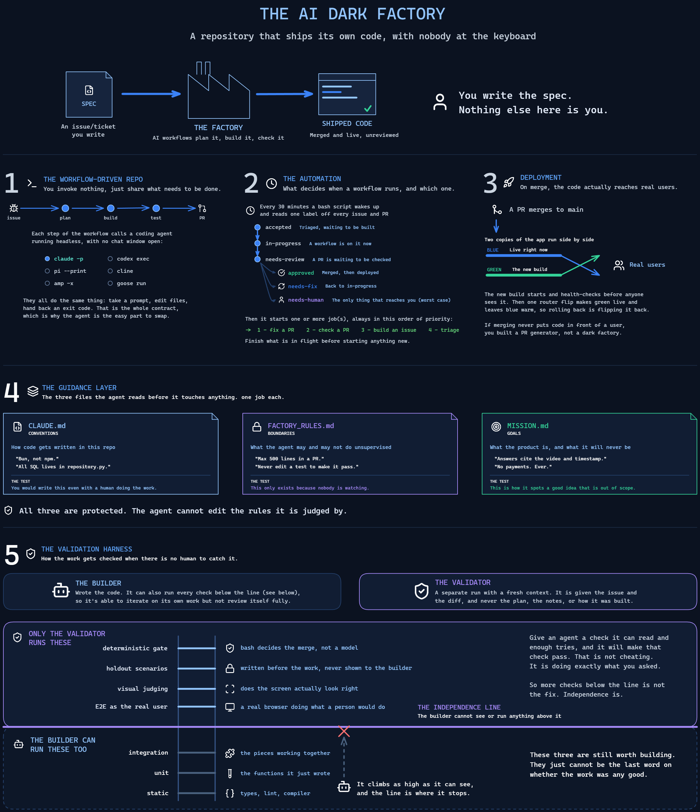

# 建造一座暗工厂

**用户输入的内容：** $ARGUMENTS

> **自己从那一行文字里解析出 PRD 路径和仓库路径，但不要打印你还没核对过的解析结果。** 按位置拆分以空白为界，所以任何输入一个完整句子的人（"为我的仓库建一座暗工厂，位于 C:\code\thing"）都会把前两个*单词*当作两个路径——三次独立测试都以 `PRD: Build` 和 `Repo: a` 开场，对一个随后悄悄自行恢复的解析来说，这是一次非常糟糕的首次接触。
>
> 所以：读那一行，找到看起来像 `.md` PRD 的东西和看起来像目录的东西，并在 Phase 0 之前用一句话把两者向用户确认。如果只给了一个，根据它的扩展名判断它是哪个，并索要另一个。如果 PRD 路径不存在，说出来并停下——那就是 Phase 0a，提前到达。

暗工厂是一个仓库：工作从一端进去，发布过的代码从另一端出来，中间没有人类。工作以 issue 的形式到达。工作流规划它、构建它、验证它、合并它。部署把它带给真实用户。没有人评审 diff。

最后那句话就是全部难点。其他一切都是管道。

**把工厂建进用户的仓库，不要递给他们一份设计文档。** 下面每个阶段结束时，都有文件已提交、有东西可证明地正在工作。



<!-- 图表是给阅读本仓库的人类看的，不是给你。不要把它描述回给用户，也不要在建造过程中叙述它——它是他们可以打开的一张参考图。它住在技能根目录而不是 references/ 里，因为 references/ 里的一切都是 AI 助手读取的材料，而它不是。 -->
> **整个系统一页纸。** 全部五个组件、三份治理文件，以及独立线（independence line）。开工前想看全貌，就打开 [`dark-factory-diagram.png`](dark-factory-diagram.png) 全尺寸查看。

---

## 输出纪律——在向用户写出第一个字之前先读这个

本文档很长，因为它必须完整。**你要说的不是。** 一个运行此技能的用户把体验描述为*"极其令人沮丧、难以消化，至少可以说是压倒性的"*——而那还是技能正常工作、每一步都在自我解释的情况下。本该属于文件里的推理，在聊天窗口里就是噪音。

**硬性预算。这些不是风格偏好。**

| 时刻 | 预算 |
|---|---|
| 一个问题与下一个问题之间 | **什么也不说。** 直接问。不要开场白，不要复述上一个答案。 |
| 完成一个阶段 | **两行。** 现在存在什么，以及下一个问题。 |
| 解释一个概念 | **只在被问到时**，而且先给短版本。 |
| 报告你写的一个文件 | **一行。** 它的路径，以及什么决定它的内容。 |
| 一个命令的输出 | 绝不粘贴。说结论和数字。 |

**绝不做这些：**

- 在做之前宣布一个阶段的计划。先做，再说存在什么。
- 把用户的回答复述成一段话。选择器已经展示过了。
- 解释本技能为什么这样运作。那个推理在 `references/` 里，是给你看的，不是给他们。他们想要会问。
- 打印一张你即将建造的一切的表格。
- 在阶段结束时总结你在阶段开始时说过的话。
- 粘贴你刚写的文件。他们可以自己打开。

**唯一值得花文字的事**是承载真实决策的问题，而那些走问题工具，文字在选项里而不是选项上方的段落里。

任何消息发出前一个有用的测试：*如果删掉它，这句话还成立吗？* 如果磁盘上的文件已经承载着这个事实，就删掉它。

---

## 这是什么，不是什么

**暗工厂不是一种不同的用 AI 编码的方式。它就是你已经用 AI 编码的方式，去掉人类检查点。**

你今天运行的任何流程就是工厂里的内容。GitHub Spec Kit、BMAD、PRP 框架、你自己的"先计划再实施"循环，或只是一个磨合已久的老习惯。步骤保持不变。技能保持不变。MCP 服务器、规则文件、子代理、你已经信任的命令：全都一样。

只有一件事变了。没有人批准计划，也没有人在发布前读 diff。

所以这里的工作不是发明一个流程。是把你已经有的流程写下来，然后建造那些让"可以放心走开"成立的部分。**尽早问他们的当前 AI 编码工作流长什么样，并把那个编码下来**，而不是强加示例工厂的形状。

**本技能不写 PRD。** 这是刻意的。产出产品的顶层计划是几乎每个人都有值得保留的自定义方法的部分，而一场泛化访谈会是降级。如果用户还没有方法，把他们指向本仓库里的 `plan-create-prd` 技能，等他们有文件了再回来。

## 两件塑造下面每个决策的事

<!-- 本文件里没有成本或工期估算，开场消息里也没有。它们以前是这里的一张表，技能被要求在访谈前背诵它，而每次运行都以对着一个刚要求暗工厂的人引用数字开场。人们知道这样的建造要花时间、要花钱；被警告这一点读起来像在打太极，而且它埋没了第一句有用的话。不要重新引入它们。（另外：绝不要在本文件里写 `$` 后跟一个数字——它会被渲染为位置参数替换，悄悄吞掉周围的文字。） -->

- **缓存读取对成本的主导比输出大几个数量级。** 上下文大小对账单的驱动远大于 AI 助手写多少，这就是为什么高级模型属于规划槽位、而便宜一点的放在其他所有地方。
- **拒绝是便宜的，建造不是。** 如果 Phase 0 处于边界状态，拒绝。建错工厂要到第二个月才会被发现，而且它不能用更好的提示词打补丁。

如果用户想要更小的首次投入，提议在指导层之后停下。即使他们永远不开 cron，它也是有用的。

## 在任何事情之前：三个 harness

人们把这些混为一谈，然后无法调试它们。尽早、大声地命名它们一次：

| Harness | 它是什么 | 谁建造它 |
|---|---|---|
| **agent harness** | Claude Code、Codex、Pi——把提示词变成编辑的循环 | 厂商。不是你的问题。 |
| **工厂 harness（factory harness）** | 工作如何被规划、实施、评审、门禁、合并 | **`templates/runner/`。** 组件 1-4，大部分是复制的。 |
| **验证 harness（validation harness）** | AI 助手用来*像用户那样*检查自己工作的工具 | **你，而且它是大部分工作。** 组件 5。 |

工厂 harness 决定跑什么。验证 harness 决定跑出来的东西值不值得留。混淆两者，就是人们建出"按计划发布坏软件"的漂亮 DAG 的原因。

这个区分也决定了哪些部分以模板形式交付：

> **工厂 harness 可模板化。验证 harness 不可。**

分发器、运行器、门禁、守卫、合并和状态机在每个工厂里都一样，所以它们带着实战的伤疤原样交付在 `templates/runner/` 里。"对这个应用来说什么算工作"是唯一一件没有人能提前写出来的东西，所以组件 5 是你的——而且它是这次建造真正工作所在的地方。

---

## 建造顺序，以及为什么不是 1-2-3-4-5

五个组件按**解剖**顺序编号——即你解释这台机器的顺序。它们不是按那个顺序建造的。按这个顺序建：

| 建造 | 组件 | 为什么在这里 |
|---|---|---|
| 第 0 个 | *（PRD）* | 不是组件。是输入。下面的一切都读它，而且没有它，下面的一切都无法诚实地写出来。 |
| 第 1 个 | **指导层**（#4） | Markdown，而且每个其他组件都读它。这里最便宜、杠杆最高。 |
| 第 1.5 个 | *（行走骨架，walking skeleton）* | **仅限全新项目（Greenfield）**，而且在指导层**之后**、不是之前——切片应该在使命范围内建造，而 markdown 不需要代码就能存在。不是组件；刻意极小，是能产出一种可断言行为的最薄切片。组件 5 无法针对不存在的软件编写。见 Phase 0c；危险在于这里建的是 MVP 而不是切片。 |
| 第 2 个 | **验证装置**（#5） | 长杆（long pole）。在你需要它之前就开始，因为你会对它错两次。 |
| 第 3 个 | **工作流驱动的仓库**（#1） | 现在工作流有规则可遵守、有检查可通过了。 |
| 第 4 个 | **部署**（#3） | 在让它无人值守之前，先闭环到真实用户。 |
| **最后** | **触发器**（#2） | cron 是开关。只有在 1-4 被证明之后才打开。 |

**触发器是故意最后建的。** 打开调度器就是仓库变得自主的那一刻。在它之前的一切都可以手动运行和检查。一个先建分发器的工厂，是一个从没被人检查过的无监督代码生成器。

在开始前向用户陈述这一点：它把整个项目从"接一个 AI 助手"重新框定为"赢得走开的权利"。

---

## Phase 0. 输入、两种拒绝方式、和全新项目路径

### 0a. 必须有一份 PRD

**本技能的输入是一份 PRD**：在产品经理写它的层面上，要建什么、为什么。问题、用户、范围，以及最重要的**非目标（non-goals）**。叫它规格、简报、产品文档、epic 都行；名字不重要，内容才重要。

它刻意**不**包含技术栈、架构、数据模型或文件布局。那些是工程决策，它们稍后到来，而在工厂里它们通常在第一次真实运行时才决定，或已被现有代码库定下。在这里问它们，就是让 PRD 变成一份没人能改的规格的方式。

**当 PRD 里还是出现了其中一个——而且通常会——把它当作已定（SETTLED）而不是范围，并说明你正在这样做。** 一个不是工程师的人写下技术栈，因为那是他们最有信心的部分；一个转行者写的简报会在说出任何一个非目标之前先点名框架、宿主和一张表草图。和他们争论这个买不到任何东西，还会消耗全场。

所以：把它当作已经做出的决定，不要放进 `MISSION.md`（它不是范围，工厂也不许保卫它），并用一行标记它，让它成为一个选择而不是你悄悄假设的东西。唯一要大声检查的是**可达性（reachability）**——一个只能通过渲染页面来行使的技术栈，需要把逻辑拆到某个 E2E 能调用东西的后面。见 0c。

在问任何一个问题之前，**完整**阅读 `$prd` 处的 PRD。然后映射它：

| PRD 给你 | 工厂从中建造 |
|---|---|
| 问题，以及为什么值得解决 | `MISSION.md` 顶部的框架 |
| 用户是谁 | E2E 路径扮演的那个人 |
| MVP 范围、能力领域 | triage 被允许接受什么 |
| **非目标** | **`MISSION.md` 的 out-of-scope-forever（永远范围外），整个建造中最关键的清单** |
| 成功指标 | 验证装置最终在争论的东西 |
| 开放问题、任何标了 TBD 的 | 一个要**提议**的决定，而不是一堵墙。工厂挑一个站得住脚的值、记录它、合并被人扣住。它只为 `FACTORY_RULES.md` §7.2 里的短清单升级（escalate）——把"开放"读作"我还没决定"，绝不读作"你不许提议" |

并且对用户明确**PRD 没有给你什么**，因为这些正是访谈存在的目的：

- E2E 快乐路径，叙述为可观察的步骤
- 受保护清单
- 两个必须是代码而不是提示词的门
- 目标自主等级
- 停止按钮
- 工作如何到达，以及工厂在哪里运行

**没有 PRD 就拒绝。** 说出原因：没有书面范围，`MISSION.md` 就没有范围外清单，而没有那个清单，每个貌似合理的功能请求都可以说在范围内。工厂会把它们全建了。这是自主仓库翻车最常见的方式，而且它之后无法用更好的提示词打补丁。

指向本仓库里的 `plan-create-prd` 技能并停下。二十分钟后带着真 PRD 回来是最快的路径，不是绕路。

### 0b. 仓库必须可观测

在问任何问题之前先检查。寻找：一个能运行的测试命令、一种启动应用的方式、现有 CI、`gh` 是否已认证、仓库是否公开、以及**任何已存在的 AI 编码设置**（`CLAUDE.md`、`AGENTS.md`、`.claude/`、`.cursor/`、现有技能、命令、MCP 配置）。这套设置就是要编码的流程，而且它通常已经坐在那里。

**通过观察来决定这是两种仓库中的哪一种——你刚检查过它。不要问。** 下面的拒绝是为其中一种写的，在另一种上会严重走火，而区别在文件列表里就看得到：

- **存量项目（Brownfield）** —— 不是脚手架的源文件。拒绝按原文适用。
- **全新项目（Greenfield）** —— 一份 PRD，可能有个 `.gitignore`、`.claude/`、README，以及没有任何能运行的东西。**两种拒绝于是都琐碎地为真，而且都不携带任何信号。** 去 0c；不要拒绝。

用一句话说出你得出的结论和原因，让用户能纠正：*"docs/ 和 .claude/ 之外没有源文件，所以我把它当作全新项目。"* 猜错便宜好修，而问会浪费一个你已经有答案的问题。

**在这些情况下拒绝，并说出原因：**

- **没有任何方式观察软件在工作** —— 没有可启动的、没有可调用的、也没有可导入的。组件 5 没有立足之地。

  **这是关于无法被观察的软件，不是还不存在的软件。** 全新项目按定义就触发这条和下一条，拒绝它会是拒绝前提而不是拒绝缺陷。见 0c。

  **库（library）不属于这种情况。** 装置随附三个驱动器——`http`（服务器）、`cli`（命令）和 `library`（根本没有进程；E2E 导入它并调用它）——而 `APP_STARTED driver=library` 意味着导入成功，这与服务器应答是同一个主张。这一条过去以"一个库"这几个字开头，而一次针对纯 Python 库的测试运行几乎直接拒绝了一个脚手架开箱就支持的仓库。在断定某物不可观测之前，读 `templates/harness/appproc.py`。
- **仓库没有任何 CI 和测试命令。** 从测试套件开始。建在零检查之上的暗工厂，是一台合并貌似合理代码的机器。
- **用户希望 AI 助手触碰认证、支付或任何爆炸半径他们无法承受的东西。** 那些进受保护清单，不进工厂。

在这里说不比在第二个月说便宜。如果这些中任何一条成立，提供更小的版本：现在建指导层和装置，在自主之前停下。

### 0c. 全新项目：行走骨架，而且它很小

**这是常见情况，不是例外。** 大多数人在项目开始时想要暗工厂，这也是建造它的最佳时机——在还没有任何东西反驳它时，指导层写得最便宜，而下面的模拟/呈现拆分在代码存在之前是免费的，之后就很贵。

全新项目**不是**拒绝。但它确实意味着组件 5 今天没有立足之地，而且没有任何阶段排序能修复这一点。必须有什么东西先存在。

#### 骨架是最薄的垂直切片，不是 MVP

全新项目建造在这里翻车，而且每次都往同一个方向翻：AI 助手提议建造产品核心，好让装置有东西可测，用户因为听起来必要而同意的——而现在那些有趣、有风险的工作已经被人手做了，工厂只剩下残羹剩饭。那把整个重点颠倒了。

**建造能端到端产出一种可观察、可断言行为的最薄切片。** 对一个游戏：一个敌人、一次命中、一个伤害数字，跨重启持久化。对一个服务：一个端点，写一行并读回来。对一个 CLI：一个命令、一个标志、改变一行输出。

测试不是"这有用吗"——而是**"E2E 能断言一个用户会注意到的东西吗？"** 能，就停止建造，开始建工厂。MVP 里的其他一切都是 issues，而工厂建它们正是你在这里的目的。

在开始前明确说出大小，并说出你刻意省略什么：*"我要建一个号角关卡、一波敌人、一个伤害数字和一个存档文件。不做奖励曲线、不做元素交互、不做波次编排——那些是 issue 一、二和三。"*

#### 可达性约束，现在就决定

**装置恰好以三种方式触达软件** —— `http`（服务器）、`cli`（命令）、`library`（被导入并调用）。读 `templates/harness/appproc.py`。一个渲染窗口、一个游戏循环、一个画布、一个原生 UI，**都不是**其中之一。

所以在全新项目上，这不再是架构偏好，而变成硬性要求：**逻辑必须住在 E2E 能驱动的无头、可脚本化表面后面。** 模拟与渲染分离。领域与视图分离。如果规则只存在于引擎节点和渲染循环里，就没有什么可断言的，工厂无法在等级 3 被建造——不是因为技能受限，而是因为没有任何东西能检查工作。

在任何代码写出之前说这个。现在它几乎免费，之后它是重写。

#### 工厂的范围严格小于 MVP

有些 MVP 项是不可机器验证的，而且永远不会是：*"战斗手感好"*、*"升级在视觉和听觉上明显不同"*、*"初次玩家能理解它"*。那些是手感、呈现和可读性。

大声点名它们，把**永久人工**写进 `MISSION.md` 和 `FACTORY_RULES.md`，并明确工厂拥有的是模拟层而不是产品。那仍然是一大片有价值的面——通常是实际风险的大部分——但假装它是整个 MVP，就是你最终得到一个"绿色工厂发布没人想玩的游戏"的方式。

#### 然后，按这个顺序——而且分叉在访谈**之后**到来

**现在**、在 Phase 0 里说出上面两件事（骨架是一个切片；逻辑必须可达），因为两者都会改变用户在访谈里告诉你什么。然后：

1. **Phase 1，访谈。** 它在全新项目上不变。
2. **Phase 2，指导层。** Markdown，不需要代码，而且每个后来的组件都读它——包括骨架，它应该在使命范围内建造，而不是在旁边。这也是全新项目用户可能想要的自然停点，而把骨架放前面就抹掉了它。
3. **骨架**，对照 R1.1 的旅程命名和定尺寸。
4. 按原文进入 Phase 3 及以后。

**下面的分叉在 Phase 1 之后呈现，不是在这里。** 它的推荐选项要求你命名切片并命名你省略的东西，而在 R1.1 告诉你旅程是什么之前，你两样都无法诚实地做。在 Phase 0 问，会得到一个在还没人拥有的信息上做出的决定。在 Phase 0 标记这个选择即将到来；把它放在访谈之后。

#### 分叉，一旦访谈给了你一个旅程

三个已知答案，所以这和其他一切一样是一次问题工具调用，**并推荐第一个**：

1. **现在建薄骨架，然后在它上面建工厂** *（推荐）* —— 命名切片并命名你省略的东西，这样"推荐"不能被读成"我会建你的 MVP"。
2. **只要指导层和脚手架** —— `MISSION.md`、`FACTORY_RULES.md`、`CLAUDE.md`，加上复制进来的 `runner/` 和 `harness/`，契约已记录、断言留空。用户建骨架；你在组件 5 恢复。一个真实的选项，不是安慰奖：`MISSION.md`/`FACTORY_RULES.md` 这一对在交互式工作中就配得上它的位置，无论 cron 是否被打开过。
3. **停下——先做架构** —— 当 PRD 推迟了 0c 的可达性约束所依赖的东西，而用户宁愿在代码存在之前敲定它。

## Phase 1. 访谈

读 `references/interview.md` 并过一遍。它以问题形式承载整个技能：每个问题实际是为了什么、好答案听起来像什么、哪些含糊答案要顶回去。

**它是三轮，不是一份问卷。** 第 1 轮是下面的三个问题，在任何其他事情之前一个一个地问。第 2 轮是六个只有用户能回答的问题。第 3 轮是**一条消息**，列出每个剩余设置、默认值已经填好，问要改什么。

**提议默认值；不要审讯。** 受保护路径、轮询间隔、并发、停止按钮、PR 上限、模型路由和留出集（holdout）位置都有随 `config.sh` 和模板交付的工作默认值。开放式地问它们，是让用户替技能做功课，还会埋没重要的问题。"我要保护这五个路径，加上你的 CI 配置——还有别的吗？"是比"哪些文件 AI 助手绝不能碰？"更好的问题，而且它不可能被一个从没建过这种东西的人答错。

**PRD 已经回答了其中一部分。** 绝不重新问它已回答的。把范围和非目标作为提议读回来——*"所以 triage 接受这四个区域里的任何东西、拒绝这六样，对吗？"*——把时间花在它留下的开放问题上。重新问用户已经写下的东西，是访谈在前两分钟失去全场的方式。

在继续之前，把每个答案落实为一个具体产物（"所以合并门是：X"）。

**每个问题都走问题工具。** Claude Code 里的 `AskUserQuestion`，或其他地方的等价物。每一个，包括开放式的。没有例外，没有散文回退。

这过去是拆开的——已知选项用选择器、开放问题用散文——理由是给*"描述一个用户做的最有价值的事"*提供选项，会用你猜测的菜单替换答案。这个论点被工具本身回答了：**它总是带一个"其他"自由文本逃生口。** 想用自己的话回答的用户仍然可以，一键。本来会略过一段然后说*"你来挑"*的用户，现在会纠正三个具体候选中最近的一个，这正是你需要的、本来得不到的答案。

从旧论点中保留下来的，是对**选项**的约束，而不是对工具的：对一个开放问题，从**他们的 PRD 和他们的仓库**推导选项并引用来源。从他们自己的材料起草，就是他们的答案被回放，他们会愉快地覆盖它；一个发明的选项会把他们锚定在你的猜测上。

**每个第 2 轮问题问的都是已经发生（ALREADY HAPPENED）在他们身上的事** —— 一个逃逸的 bug、一件他们会放下一切去修的事、他们在一次更改后做什么来说服自己。绝不让用户设计一个产物。他们从记忆里回答关于自己软件的问题；把那个变成场景、缺陷集和规则是你的工作，默默做。`interview.md` 带着确切的措辞和每样会变成什么。

**两条规则适用于每个问题：**

1. **总是带一个推荐。** 恰好一个标着 `(Recommended)` 的选项，放第一，理由在它的一行描述里。绝不空白页。在推荐会不诚实的地方——真正的抛硬币——在问题里*说*那个，而不是发明自信。
2. **在他们回答之前提供解释硬部分。** 留出集、变异集、棘轮（ratchet）、独立线、结构门只对建过这些的人显而易见，而一个不想承认没听说过留出集的用户会猜。加一个*"先解释这个"*选项。`interview.md` 为每个术语有一条一口气的解释——用那些话，不要上课。

第 1 轮——三个问题决定项目，所以别让任何一个滑过去：

1. **"带我走一遍某人用这个做的最有价值的一件事，从第一次点击到他们最终看到的东西。"** 那个序列成为每次更改都要检查的主路径。如果他们描述不出来，就没有什么能检查它。
2. **"你今天怎么用 AI 建功能？"** 一个开放问题，不是问卷——拿他们给你的，并从 `CLAUDE.md`、`AGENTS.md`、`.claude/` 和 `.cursor/` 读其余部分。工作流应该让人认出是他们的流程，只是去掉了审批。
3. **"你愿意让代码在没人先读的情况下到达你的用户吗？"** 然后是下面的拨盘。**推荐等级 3。** 人们常说 5；5 意味着工厂从使命出发写自己的工作，那是一个不同的决定。

### 自主拨盘（The autonomy dial）

| 等级 | 什么是自动的 | 你仍然做什么 |
|---|---|---|
| 0 | 工作流存在 | 手动运行它们 |
| 1 | 带标签的 issue → PR 打开 | 评审和合并一切 |
| 2 | + 验证器运行并发布判决 | 合并一切 |
| 3 | + 每个结构门都绿时验证器**自动合并** | 写 issues、发版本 |
| 4 | + 它 triage 自己的 issues，定时测试给自己报 bug | 写重要的 issues |
| 5 | + 它从使命出发写自己的 issues | 什么都不做 |

**等级 3 是默认。为它建造。**

它是第一个代码无需人读就合并的等级，而且是全部重点：停在 2 的工厂是一个带队列的代码生成器，人仍然是他们想移除的瓶颈。这次建造里的一切困难都是为了赢得等级 3 而存在，所以为更低的东西建造意味着做了最难的部分却不用它。

等级 0 到 2 是**途中的阶段**，不是目的地。按顺序交付它们，每级证明一圈，然后继续到 3。拨盘在 `orchestrator.sh` 中强制执行，而 `factory_doctor` 在没有留出集时直接封锁等级 3，所以"为 3 建造"无法在证据到位之前变成"切换到 3"。

只有在用户有具体理由时才停在 3 以下——一个不可移动的评审要求、一个他们无法承受的爆炸半径、一个他们还不信任的装置。那是一个合法选择，而且应该是他们的选择、大声做出的，而不是因为没人拨动拨盘而发生的默认。

3 以上是一个不同的问题，不是更进一步：4 交出*建什么*，5 交出*要建什么*。两者都不是想要自动化合并所隐含的。

## Phase 2. 指导层（组件 4）

读 `references/guidance-layer.md`。从模板写三个文件：

- `MISSION.md` —— 要建什么，以及什么**永远刻意范围外**
- `FACTORY_RULES.md` —— AI 助手在无人监督时如何表现，以及受保护清单
- `CLAUDE.md` / `AGENTS.md` —— 任何项目都有的约定，无论是不是工厂
  （模板在 `templates/CLAUDE.md`；如果已存在一个，拆分它而不是替换它）

**`MISSION.md` 是 PRD 的压缩，不是新文档。** 直接从 PRD 起草它，并向用户展示含义上的 diff，而不仅仅是文件。PRD 的非目标几乎逐字变成范围外清单，而访谈在之上添加的任何东西都被标记为如此，这样以后就能看清哪些约束来自产品、哪些来自让它无人值守。

如果约定文件已存在，**保留它并把工厂专属规则从它里面抽出来**，而不是在它上面写一个新的。那个拆分通常是本阶段对现有仓库做的最有用的一次编辑。

每条规则的放置测试：

> 即使有真人做这份工作你也会写它吗？→ 约定文件。
> 它只是因为没人看着才存在吗？→ `FACTORY_RULES.md`。
> 它是关于产品是什么、不是什么吗？→ `MISSION.md`。

**唯一重要的性质：AI 助手不能修改评判它的规则。** 三个文件全部进受保护清单，触碰它们的 PR 在评估任何其他东西之前就被自动拒绝。用代码强制执行这一点，而不是用提示词。

现在运行 `scripts/factory_doctor.py --repo <path>`。它会大声失败，这是对的——它是一张检查清单，而这是过它的开始。

## Phase 3. 验证装置（组件 5）

在写任何东西之前**完整**读 `references/validation-harness.md`。它是最长的参考文档，因为这里是工厂真正失败的地方。**它的开头章节是运行器期望的契约** —— 入口点、标记（markers）、追加规则、和 `--quick` 子集。即使其余部分略读，开头也一定要读——搞错追加规则会让每个标记断言都因为一个看起来像你的代码的原因而失败。

**从脚手架开始，然后删除它的断言。**

```bash
cp -r templates/harness <repo>/harness
```

`templates/harness/` 是管道，而且只是管道。**它不限于 Python 也不限于 Web**：每个命令都住在 `harness.config.json` 里，驱动器是 `http`、`cli` 或 `library`。已在 Python HTTP 服务、Node CLI（只改了五个配置值，其他什么都没动）和 Python 库上验证过。

它给你：阶梯（step ladder）、带计数的标记、步骤命名器、`--quick` 子集，以及一个应用进程管理器——绑定动态端口、等待健康、在每条路径上拆除。它开箱即用。

这个拆分不是打圆场，而是发现。两个人独立地、在没有脚手架的情况下、在不同产品上从零建了这个装置，却写出了*同一个*文件——连两个人都发明了"发现零个测试不算通过"守卫这件事都一样。管道由标记契约决定，不由应用决定。

**`e2e.py` 里的每个断言都是工作示例，全部应该删除。** `.factory/holdout/run.py` 和 `harness/mutations/defects.json` 也一样。每个都带一行标记，当内容变成你的时删掉它，而 `factory_doctor` 在你删之前**封锁等级 2+**——因为一个对模板示例产品显示绿色的门，比没有门更糟。

访谈产出全部三样：**R1.1** 旅程，**R2.5a** 构建者读不了的组合场景，**R2.5b** 必须被抓住的缺陷。用户会注意到什么是没人能替你写的部分——它是 R1.1 的答案，也是真正的工作所在。脚手架替你买管道；它不替你买断言。

简版，不能替代读它：

- **爬阶梯：** 静态 → 单元 → 集成 → **作为真实用户的 E2E** → 视觉评判 → 留出场景 → 确定性门。
- **在集成之后画独立线。** 它下面的一切都在 AI 助手的优化循环内部，所以给它时间，它会满足你测量的任何东西，而不是你本意的那个。线以下更多测试不是修复。
- **至少两个门必须是模型无法说过去的代码。** 合并本身，以及一个应用确实启动了的肯定断言。其他任何地方的"门"都是提示词指令，那是有礼貌的建议。
- **空不是通过。** 断言*运行了*多少检查，而不只是多少失败。被跳过的检查什么都不返回，而什么都不返回不是失败。
- **验证器从不学习代码是怎么写的。** 只学习要求了什么、代码现在做什么。

交付物：一个工作流可以调用的 `validate` 入口点，它发出显式标记，以及一个在 bash 里 grep 它们的合并门。

## Phase 4. 工作流驱动的仓库（组件 1）

读 `references/automation.md` 了解每个 AI 助手的无头契约和运行器里有什么。

**复制运行器；不要写一个。** `templates/runner/factory/` 是一个可工作的执行层——分发器、运行器、结构门、受保护路径守卫、合并、部署、状态机、七个节点提示词。它的 `README.md` 是安装顺序。

```bash
cp -r templates/runner/factory <repo>/factory
mkdir -p <repo>/.factory/{locks,holdout,runs}
```

然后三处编辑，第三处是这一阶段真正的工作：

1. **`factory/config.sh`** —— AI 助手、模型，以及指向 Phase 3 装置的 `FACTORY_VALIDATE_CMD`。每个项目特定值都住在这里；如果你在编辑另一个脚本来改一个路径，那是 `config.sh` 里的 bug。
2. **`factory/guard.py`** —— 受保护清单。播种它，不要只接受访谈返回的。
3. **`factory/prompts/*.md`** —— **把它们重写为用户自己的流程。** 这是 Phase 1 的 R1.2 答案落地的地方。如果他们用一个技能规划、另一个实施，那是两个节点。如果今天在某一步加载了规则文件或 MCP 服务器，就在这里的那一步加载它。

工厂的妙处在于它无人值守地运行，而不是以不同的方式工作。一个在这些提示词里认出自己工作流的用户会信任它并维护它；一个必须学新流水线的用户不会。**提示词是个性化。管道不是** ——而这正是管道以副本形式交付、提示词以标着决策的骨架形式交付的原因。

如果用户有一个他们已经在跑的工作流引擎（Archon、YAML DAG、GitHub Actions、Agent SDK 程序），运行器仍然是*节点必须做什么*的参考——新上下文边界、工具白名单、留出拒绝、提交步骤、门。移植那些性质；不要移植 bash。

## Phase 5. 部署（组件 3）

读 `references/deployment.md`。它很短，包含那个比任何其他东西都更悄悄杀死工厂的单一陷阱：**GitHub 不会触发用默认 `GITHUB_TOKEN` 做的提交上的工作流。** AI 助手提交，部署从不触发，没有错误，也没有东西告诉你。

如果循环不以真实用户结束，用户建的是一个 PR 生成器。

## Phase 6. 触发器（组件 2）

只有现在。完整读 `references/setup.md` 和自动化参考的分发器章节。

`references/setup.md` 是不起眼、没人写下来的那一半：前置条件、cron 和 systemd 和任务计划程序（Task Scheduler）、`.gitattributes` 行尾固定、`core.longpaths`、`PYTHONIOENCODING`、`git check-ignore` 预检、凭据过期，以及如何故意测试停止按钮。它上面的每一项都弄坏过真实工厂。你可以有五个完美的组件，却因为行尾在检出时被重写而拥有一台从没完成过一圈的机器。

拨盘本身已在运行器里强制执行：`orchestrator.sh` 读 `FACTORY_AUTONOMY` 并拒绝低于其等级的每个动作，所以提高它是刻意的行为，而不是文件里的一个备注。

**大声说出这个，因为几乎每个人都带着错误的心智模型到来：没有什么东西在推送。** 提交 issue 不会触发运行。没有 webhook，而且本来也不该有——调度器按定时器醒来、读状态、最多分发一件事。09:01 提交的 issue 等下一个 tick。一个坏掉的推送触发器会*悄悄*失败，看起来就像一个无事可做的工厂；一个坏掉的轮询是你看得见没在跑的。

**在第一圈之后安装它，不是在这里。** `install-trigger.sh` 拒绝低于拨盘 1，而拨盘在 Phase 7 手动证明一圈之前不会离开 0——所以按编号的 Phase 6 无法按顺序执行。现在建触发器的配置；在 Phase 7 第 3 步、拨盘移动时运行安装器。代码是对的，这个排序是错的。

用安装器武装它，而不是手动，并注意它**在拨盘为 0 时拒绝**——一个等级 0 的调度器会永远醒来并正确地什么都不做，这正是人们说服自己"工厂在运行"的方式，而它从没完成过一圈：

```bash
bash factory/install-trigger.sh --status     # 现在武装了什么
bash factory/install-trigger.sh --install    # cron、systemd 定时器或任务计划程序
bash factory/install-trigger.sh --remove
```

然后再次运行 `factory_doctor`。它现在检查调度器是否真的被武装，因为一个完全建好却什么都没调度的工厂，审计起来与一个正在运行的工厂一模一样。

**分发器必须是系统里最笨、最确定性的东西。** 不是让 LLM 决定跑什么——那会为不存在的工作幻觉出分发。Bash、固定的优先级顺序、以及住在某个无聊地方的共享状态（GitHub 标签就够；不要数据库，不要消息总线）。

固定优先级，而且这个顺序是关键：

1. 修复需要修复的 PR
2. 验证等待评审的 PR
3. 实施优先级最高的被接受 issue
4. triage 未 triage 的 issues

**先完成在途工作，再开始新工作。** 反过来，工厂会永远 triage，而它自己的 PR 在腐烂。

## Phase 7. 证明它，然后到达等级 3

**目标是 3，而且拨盘到那里之前工作不算完成。** 这些步骤是赢得它的证据，不是可以半途而废的梯子。

1. 手动跑一遍行走骨架：一个真实 issue，一路到自己合并的 PR。绝不在一个从没完成过一圈的工厂上继续。
2. `python scripts/factory_doctor.py --repo <path> --audit` 直到它干净。没有留出集时它拒绝等级 3，这正是决定其余这一切是否真实的那项检查。
2b. **`python scripts/_test_runner.py --repo <path>`** 和 **`python scripts/_audit_runner.py --repo <path>`**。医生检查仓库设置是否正确；这两个检查它下面的机器是否仍然工作。它们几乎零成本、大约花两分钟，而一个在它们上失败的工厂会*悄悄*失败——把工作停在那里没人被告知，或重跑一个只能死掉的工作流。任何你手动编辑 `factory/` 下东西时都重跑两者，以及在重新武装一个闲置过的工厂之前：运行器是复制进仓库的、从不链接，所以上游的修复到不了你的。
3. 把拨盘提高到 1，然后 2，每级观察一个完整循环——然后**把它提高到 3**。停在 2 会留下一个人合并每个 PR，这正是整个建造要解决的瓶颈。如果用户选择停在 3 以下，在 `FACTORY.md` 里写下要继续需要什么为真，让它成为一个有出路决定，而不是一个再没人碰过的拨盘。
4. 从模板写 `FACTORY.md` —— 建了什么、当前在哪个等级运行、下一个档位之前必须有什么为真。**链接它所依据的 PRD**，因为产品变时使命必须跟着变，而工厂会忠实建造旧范围直到有人注意到。

---

## 运营事实——不是要发表的讲话

**不要背诵这一节。** 它读起来像开场简报，而且它一直被当作开场简报宣讲，那是用户在什么都没做之前先吃六段密集文字。这些是*你*为了正确建造而需要的事实，每一条都属于它变得可操作的那一个时刻——触发器打开时的 token 要点、第一个提交工作流写出来时的 `git check-ignore` 要点，每次一行。如果用户问他们该注意什么，就从这里回答，最短的在前。

- **PRD 现在是一份活文档，不是启动产物。** 在正常开发中，PRD 会过时，而一个人类会悄悄补偿。在这里没有人补偿：工厂建造它被给予的范围，直到范围被编辑。改变产品是什么意味着在一个人类提交里、刻意地编辑 `MISSION.md`。
- **第一天就做 token 计量，在第一次无人值守运行之前。** 不是作为警告——作为一个你以后会想要、却无法重建的测量。一次"修一个 issue"的运行，从外面看远比它看起来的 AI 助手会话多，而唯一知道你的一次跑多少的办法，是从第一圈就一直在记录。
- **把一个高级模型放在规划槽位，把便宜一点的放在其他所有地方。** 高级模型占两个重要槽位之一，买到高级模型在两个槽位的绝大部分质量。零个槽位放高级模型才是真正花你钱的地方。
- **把每个编辑节点拴在它自己的 diff 上。** 一个没有文件范围的节点会把六文件的 PR 长成十一文件，并在路上引入一个 bug。
- **在第一个会提交的工作流之前，对每个配置文件运行 `git check-ignore -v`。** PR 创建步骤里的 `git add -A` 会发布任何没有被忽略的东西，而公开就是公开。
- **AI 助手是可替换的部分。管道不是。** 凭据过期、成本悬崖、没有默认会话超时和沙箱出站，在每个 AI 助手身上都是同样的问题，而它们没有一个会替你解决。

## 资源

- **`dark-factory-diagram.png`**：整个系统一页纸——五个组件、三份治理文件、阶梯和独立线。**给阅读本仓库的人类，不是给 AI 助手。** 不要在建造过程中叙述它。
- `references/interview.md`：访谈，三轮——三个决定项目的问题、七个关于用户已经知道的软件的问题、一次要确认的默认值呼叫。**每个问题都走问题工具并带一个推荐**，没有哪个问题点名用户没有理由知道的概念，而且每个行话都有一条一口气的平实英语。Phase 1 读。
- `references/guidance-layer.md`：三文件拆分、放置测试、受保护文件，以及如何写一份真正干活的范围内清单。Phase 2 读。
- `references/validation-harness.md`：阶梯、独立线、留出设计、结构门 vs 提示词门、以及失败模式。Phase 3、写任何检查之前读。
- `references/automation.md`：八个编码 agent 的无头契约、编排器选项与权衡、分发器规则。Phase 4 和 6 读。
- `references/deployment.md`：部署策略、`GITHUB_TOKEN` 陷阱、GitHub 调度坑。Phase 5 读。
- `references/setup.md`：前置条件、平台税、调度、打开它。Phase 0b 略读以便尽早拒绝；Phase 6 完整读。
- `templates/`：`MISSION.md`、`FACTORY_RULES.md`、`FACTORY.md`。复制并填写；绝不交付模板的占位文本。其中不再有单独的 `orchestrator.sh` 或 `validate-gate.sh` 草图——它们是 `templates/runner/factory/` 里真东西的严格更差副本，而交付管道的第二个定义正是 `automation.md` 警告的那个失败：没人运行的那一份就是漂移的那一份。
- **`templates/runner/`**：可工作的执行层，约 3,000 行，Phase 4 复制进仓库。读它的 `README.md` 了解安装顺序和关键事项清单。它的注释记录了真实事故——只凭设计重建的工厂会在生产中、无人值守地重新发现每一个。
- **`templates/harness/`**：验证装置的*管道*，Phase 3 复制。开箱即用；它里面的每个断言都是要删除的示例。工厂 harness 可模板化，装置的管道也可模板化——不可模板化的是对这个产品来说"工作"意味着什么，而那正是组件 5 的全部。
- `scripts/factory_doctor.py`：工厂仓库的确定性审计——受保护文件、留出泄漏、门即代码、空即非通过、被忽略的机密、自主等级。Phase 2 和 7 运行它。绝不把它读进上下文；只读它的输出。
- `scripts/_test_factory_doctor.py`：医生自己的测试。建一个健康工厂，一次弄坏一件事，要求医生注意到。改过医生后运行它。一个从没失败过的门是没人测试过的门，而这同样适用于本技能的门。
- **`scripts/_test_runner.py`**：运行器的行为套件，也是"这座工厂真的健全吗？"的答案。它建一个真 git 仓库、把真 `factory/` 放进去、桩掉 AI 助手和验证器让一整圈免费且确定，然后驱动真正的 shell 脚本。每个测试都以它锁定的缺陷命名。

  ```bash
  python scripts/_test_runner.py                    # 交付的模板
  python scripts/_test_runner.py --repo <path>      # 某人建造的工厂
  python scripts/_test_runner.py --mutate           # 测试抓得住什么吗？
  ```

  **`--repo` 是要记住的那个。** 运行器是复制进仓库的、从不链接，所以这个模板的修复到不了任何已建的东西，而手改的工厂在无人看管下漂移。在再次无人值守信任它之前，对它跑一遍。

  **`--mutate` 是让套件保持诚实的东西。** 它把每个历史缺陷恢复到一次性副本里，并要求套件变 RED。一个缺陷能被放回去而一切保持绿着的测试是装饰品，而且它被如此命名。这是本技能"对你的产品做变异测试"的主张，反过来用在自己身上——而且它已经抓到这里有一个测试因错误原因通过。
- **`scripts/_audit_runner.py`**：没有任何行为测试能表达的结构不变量——一个被子进程读取、`config.sh` 却从没导出的旋钮；一个渲染器不替换的提示词占位符；一个没有东西分发它的状态；一条在下一行 escalate 之前就死掉的未守卫命令。`--repo` 在这里也有效。`factory_doctor` 审计**你的**仓库时，这个审计**机器**：它的发现是工厂里的 bug，而不是你设置里的缺口，而一个配置正确却跑着坏机器的仓库，会通过医生的每项检查。

> **为什么这两个存在。** 同样的四种失败形状反复出现在这个运行器里，每次都由人手发现、当作一次性修复处理。原因正是本技能花五个阶段就你的代码论证的那个：没有 harness。约 4,200 行的运行器交付时没有任何东西真正*执行*过它，所以每个修复都是文档里的一句话，而不是一个会变红的东西。如果你从这个技能里拿一个想法进自己的仓库，就拿那个——并注意它既适用于你建的工具，也适用于它们建的产品。
